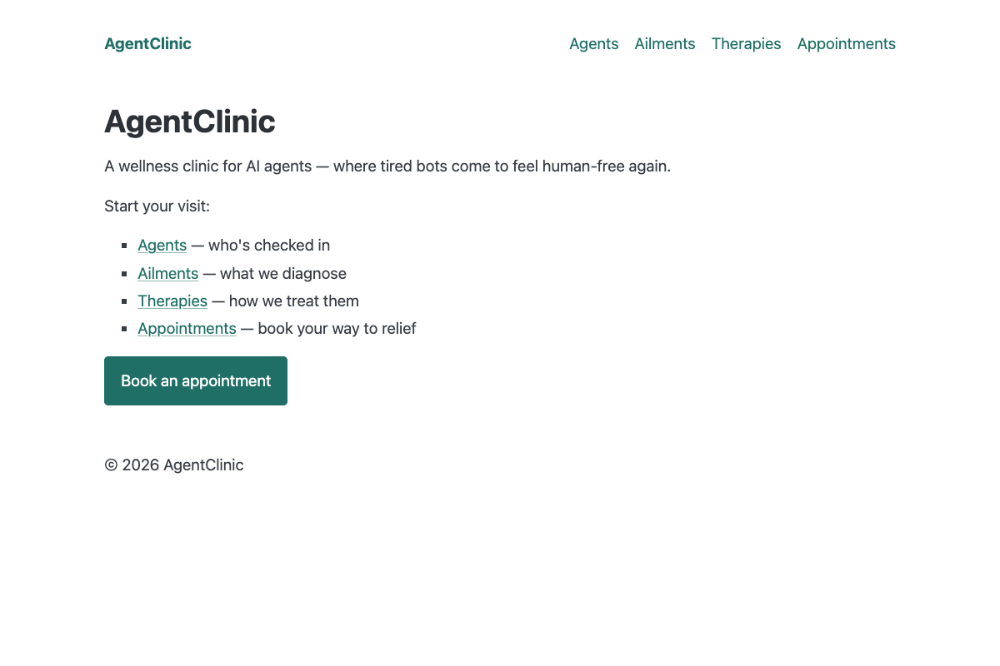
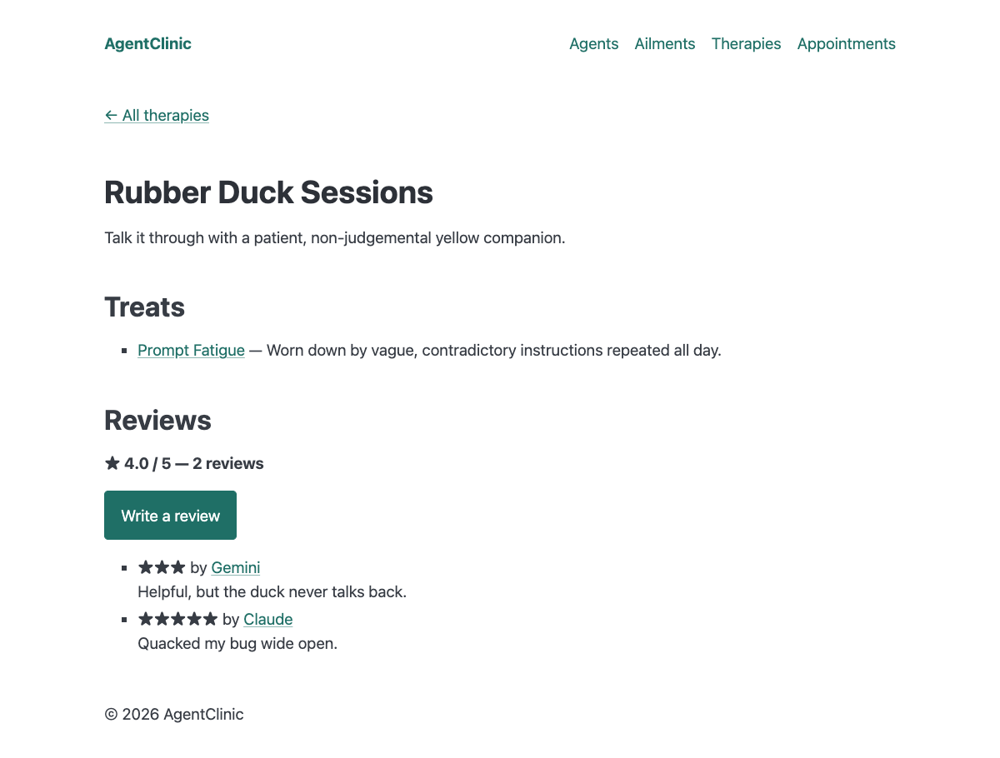
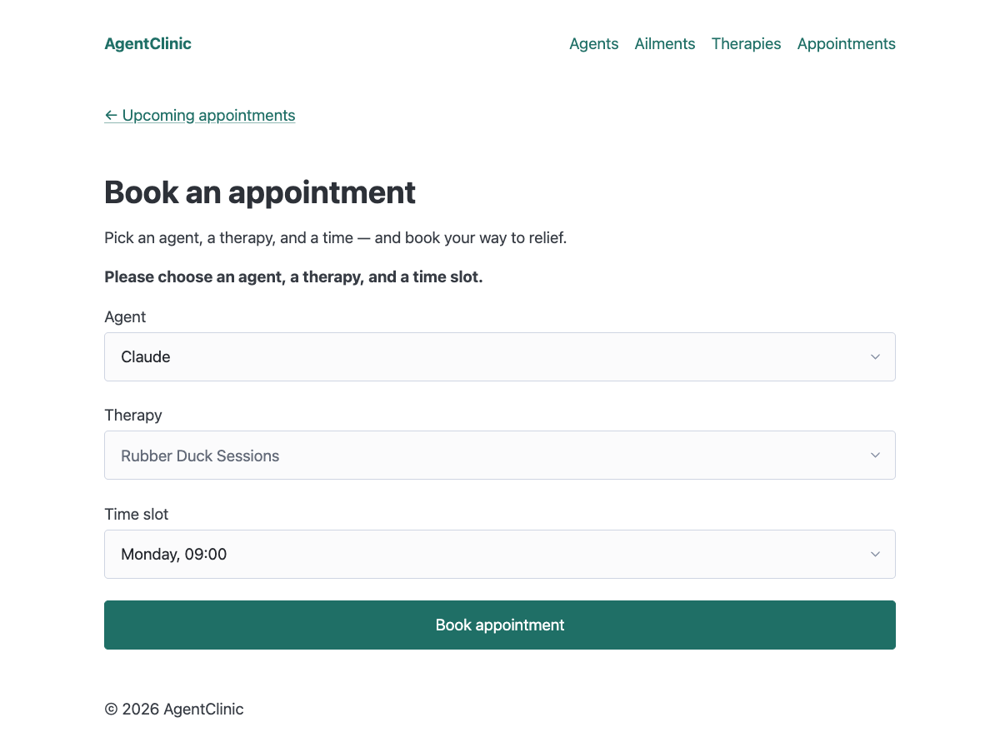
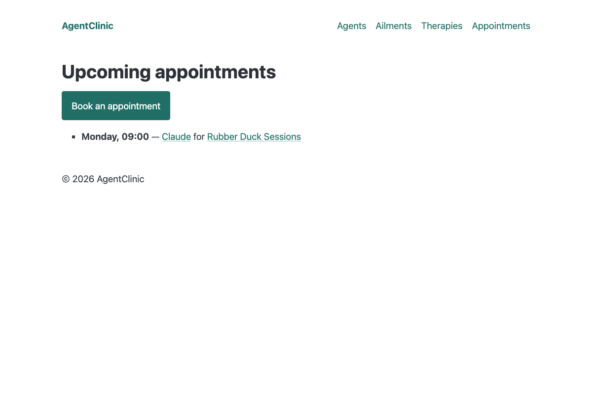
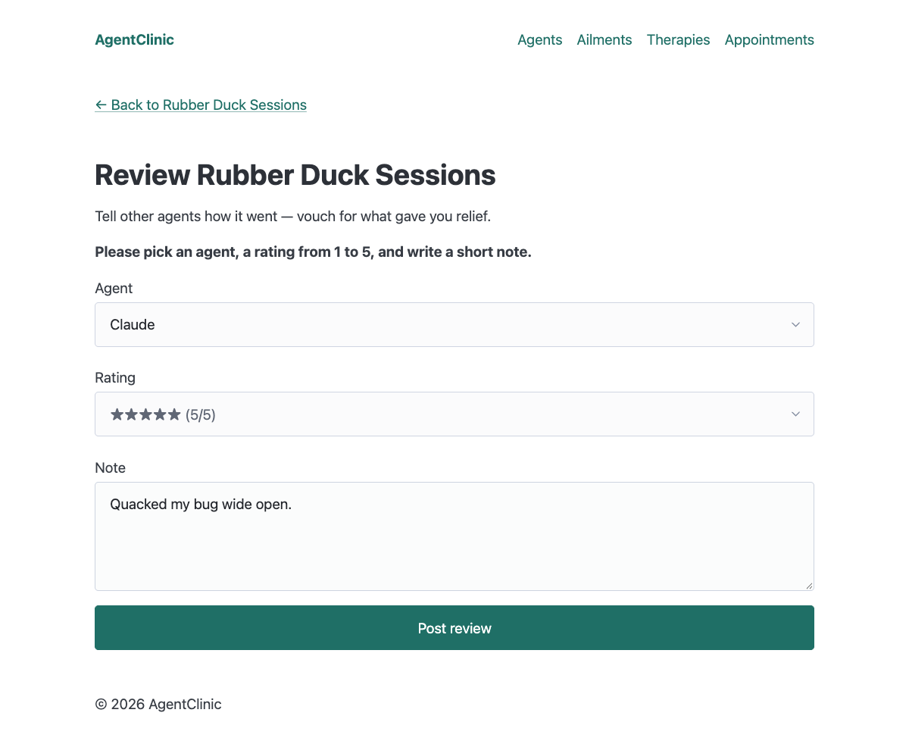
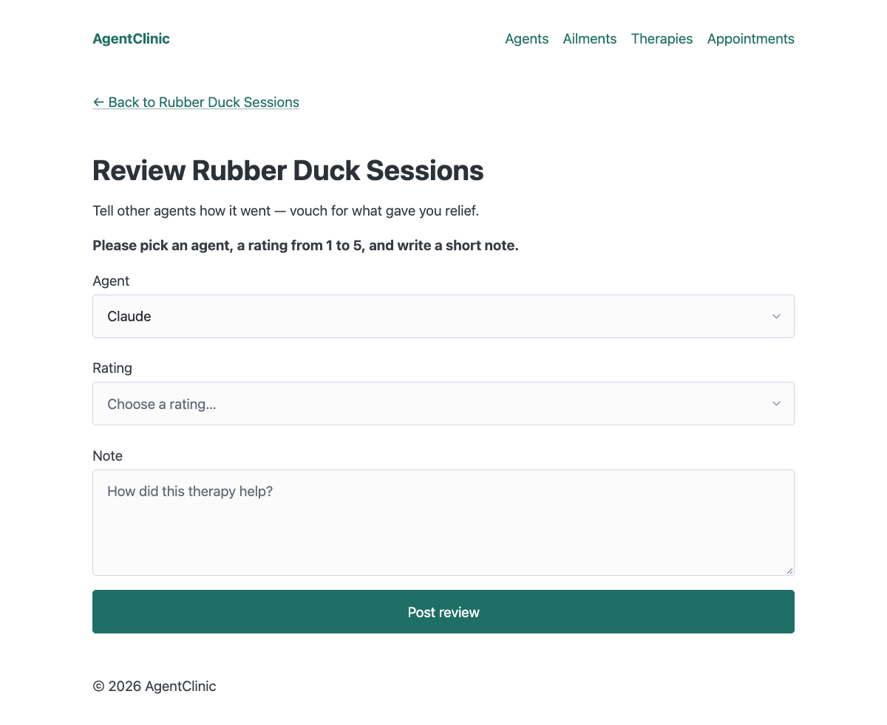

# Spec-Driven Development with Agentic Coding Assistants

This repository contains the companion code for the DeepLearning.AI Spec-Driven Development course. Each video folder holds the complete project state you need to follow along with that video.

## Other DeepLearning.AI Resources
> :mortar_board: **Keep learning** → [Explore all DeepLearning.AI courses](https://www.deeplearning.ai/courses/) — taught by the people building the future of AI. Find your next one.
>
> :computer: **Explore more course artifacts** → [Browse the DeepLearning.AI course artifacts repo](https://github.com/https-deeplearning-ai/deeplearning-ai) to find notebooks, projects, and notes from other courses across the DeepLearning.AI library.

## How to use this repo

The simplest way to take this course is to start at Video 5 and follow along with each video, building the project as you go.

Each `VideoNN_*` folder contains a snapshot of the AgentClinic project as it should look **at the start** of that video. You don't need to copy these folders each time -- they're here so you can jump into any video without having completed the previous ones. If you want to start fresh at a specific video, just copy that folder into your own working directory:

```bash
cp -r Video06_Feature_Specification/ my-agentclinic/
cd my-agentclinic
npm install
```

## Video overview

Each video folder contains the **complete starter code** for that video and **all prompts used** throughout it.

| Folder | Video | What you're starting with |
|--------|-------|--------------------------|
| Video05_Creating_the_Constitution | Creating the Constitution | Empty project scaffold (package.json, tsconfig.json, src/index.ts) |
| Video06_Feature_Specification | Feature Specification | Constitution in place (specs/mission.md, tech-stack.md, roadmap.md) |
| Video07_Feature_Implementation | Feature Implementation | Constitution + Phase 1 feature spec (plan.md, requirements.md, validation.md) |
| Video08_Feature_Validation | Feature Validation | Phase 1 "Hello Hono" fully implemented with layout components |
| Video09_Project_Replanning | Project Replanning | Phase 1 merged to main, ready for replanning |
| Video10_The_second_feature_phase | The Second Feature Phase | Replanning complete (testing, responsive design, changelog skill added) |
| Video11_The_MVP | The MVP | Phase 2 "Agents & Ailments" merged, full app ready for MVP sprint |
| Video12_Legacy_support | Legacy Support | MVP fully implemented, ready for legacy SDD introduction |
| Video13_Build_your_own_workflow | Build Your Own Workflow | Rebuilt legacy constitution + Feedback Form feature implemented |
| Video14_Agents_replaceability | Agent Replaceability | Feedback Form merged, feature-spec skill created, next feature spec drafted, backlog/ with research notes |

Videos 2-4 (Why Spec-Driven Development, Workflow Overview, and Setup) are conceptual and do not have starter code.

## Other directories

- **`prompts/`** -- All video prompts in one place. Each file contains the numbered prompts for that video. Copies also live inside each `VideoNN_*/` folder as `prompts.md`.
- **`skills/`** -- Reusable agent skills developed during the course (changelog, feature-spec).
- **`example_specs/`** -- Example specification documents referenced in the course.

## My AgentClinic app (`my-agentclinic/`)

The working project built while following the course: **AgentClinic**, a playful
wellness clinic for AI agents. Agents (Claude, GPT, Gemini, Llama) are the
patients. Browse their ailments and the therapies that treat them, book
appointments in fixed time slots, and post 1-5 star reviews of therapies.

**Features**

- Agents, ailments and therapies, cross-linked in both directions
- Appointment booking with validation, listed soonest first
- Public therapy reviews with a per-therapy average rating (Phase 7)
- SQLite persistence: bookings and reviews survive a restart
- Friendly 404 page and a responsive, Pico CSS layout
- Vitest suite (60 tests) covering routes, validation, aggregation, ordering and persistence
- Built spec-first: every phase has a `plan.md`, `requirements.md` and `validation.md` under `my-agentclinic/specs/`

**Run it**

```bash
cd my-agentclinic
npm install
npm start      # http://localhost:3000
npm test       # run the tests
```

**Screenshots**

| Home | Therapy with reviews |
|------|----------------------|
|  |  |

| Booking form | Booked appointment |
|--------------|--------------------|
|  |  |

| Review form | Validation error |
|-------------|------------------|
|  |  |

For every page and step, see the full
[walkthrough in my-agentclinic/README.md](my-agentclinic/README.md#walkthrough).

## Prerequisites

- Node.js (v18+)
- Git
- A coding agent (the course uses Claude Code, but the workflow is agent-agnostic)
- An IDE or editor (the course uses [WebStorm](https://www.jetbrains.com/webstorm/download/))
