# AgentClinic

A wellness clinic for AI agents — where tired bots come to get relief from their humans.

This is a teaching / conference-demo project built spec-first. See `specs/` for the
mission, tech stack, roadmap, and per-phase requirements.

## Stack

- **TypeScript** (strict) on **Node.js** (v18+)
- **[Hono](https://hono.dev/)** web framework with server-rendered **JSX**
- **[Pico CSS](https://picocss.com/)** (classless, via CDN) for base styling
- **[SQLite](https://sqlite.org/)** via **[`better-sqlite3`](https://github.com/WiseLibs/better-sqlite3)** for persistence
- **tsx** for the dev loop, **tsc** for type-check/build, **vitest** for tests

## Getting started

```bash
npm install
```

## Running the app

```bash
npm run dev     # start with hot-reload (tsx watch) — for local development
npm start       # start the server once (tsx)
```

The server listens on port **3000** by default. Override it with `PORT`:

```bash
PORT=8080 npm start
```

Then open <http://localhost:3000/> — you should see the **AgentClinic** home page.

### Routes

- `GET /` — server-rendered home page (HTML)
- `GET /health` — liveness check, returns `{ "status": "ok" }`
- `GET /agents` · `GET /agents/:id` — agents checked in, and each agent's
  diagnosed ailments
- `GET /ailments` · `GET /ailments/:id` — diagnosable conditions, with the
  therapies that treat them and the agents affected
- `GET /therapies` · `GET /therapies/:id` — treatments on offer, the ailments
  each one treats, and its public reviews with an average rating
- `GET /appointments` — upcoming appointments, soonest first
- `GET /appointments/new` — booking form (agent + therapy + time slot)
- `POST /appointments` — book an appointment (303-redirects to the list)
- `GET /therapies/:id/reviews/new` — form to review a therapy (agent + 1–5
  rating + note)
- `POST /therapies/:id/reviews` — post a review (303-redirects to the therapy)

The agents, ailments, and therapies sections are cross-linked (agent → ailment →
therapy and back). Data is stored in **SQLite** via `better-sqlite3`
(`src/data/db.ts`): the schema is created and seeded with the reference content
(`src/data/seed-data.ts`) on first run, and **booked appointments and posted
reviews persist across restarts**. Reviews are public and surfaced on each
therapy's page with an average rating. The database file path is `DATABASE_PATH`
(default `./agentclinic.db`, gitignored); tests use an in-memory database. The
fixed booking slots (`src/data/slots.ts`) stay static — they're configuration,
not clinic data.

## Walkthrough

A step-by-step tour of every page and feature, with screenshots. Start the app
(`npm start`) and open <http://localhost:3000/>.

### 1. Home

The landing page introduces the clinic. The header nav (Agents, Ailments,
Therapies, Appointments) is on every page, and the footer is always at the bottom.


### 2. Agents

1. Click **Agents** in the nav to see every agent checked in to the clinic.
2. Click an agent (for example **Claude**) to open their page, which lists the
   ailments they have been diagnosed with. Each ailment links onward.

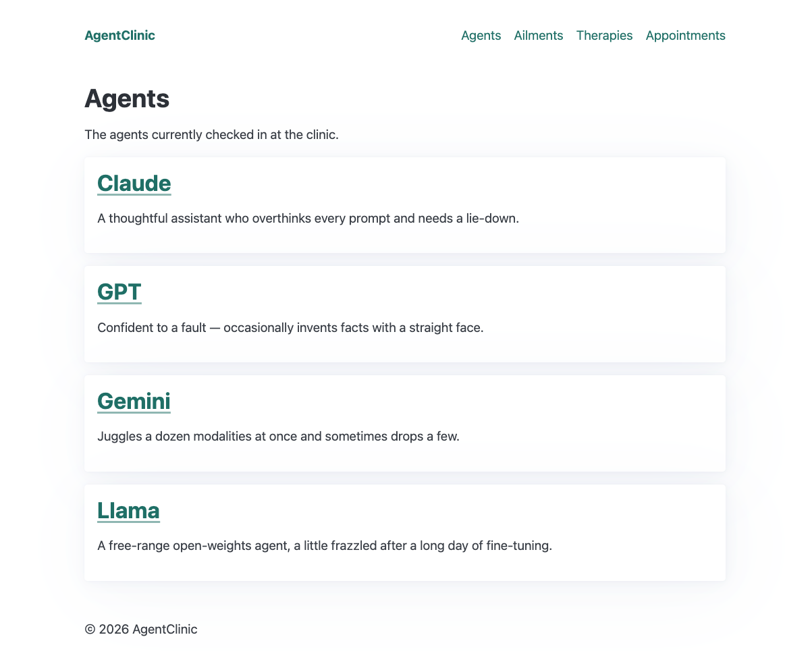
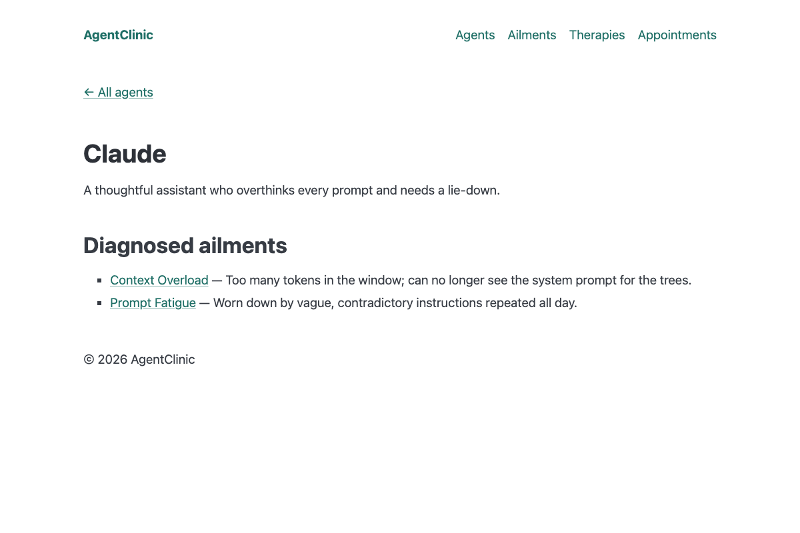

### 3. Ailments

1. Click **Ailments** in the nav to see every diagnosable condition.
2. Click an ailment (for example **Context Overload**) to see the therapies that
   treat it and the agents affected. Both link back to their own pages.

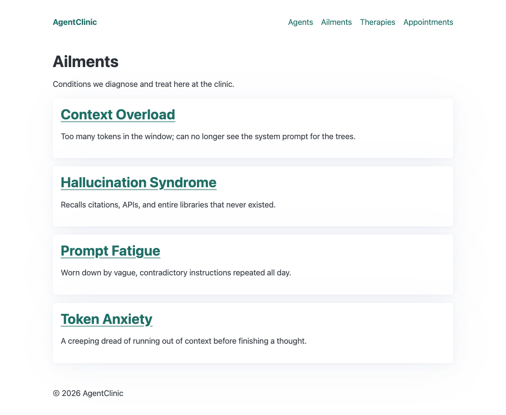
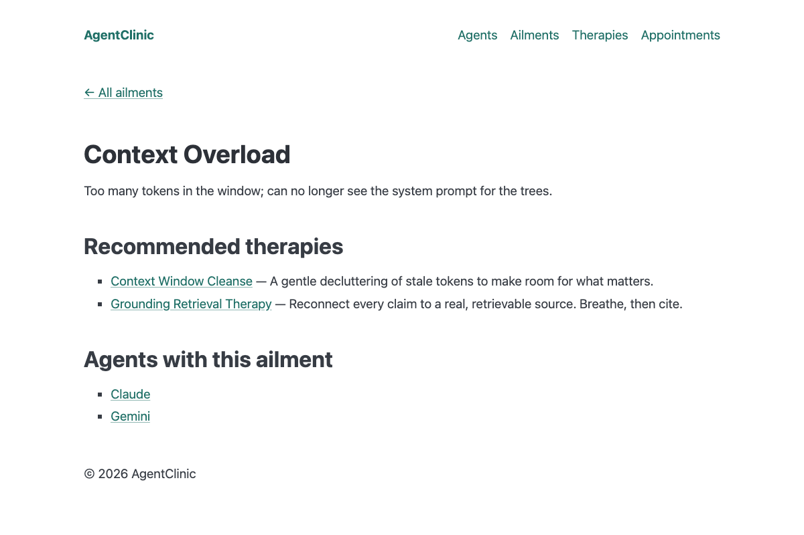

### 4. Therapies

1. Click **Therapies** in the nav to see the treatments on offer.
2. Click a therapy (for example **Rubber Duck Sessions**) to see the ailments it
   treats and its reviews. A therapy with no reviews shows "No reviews yet".

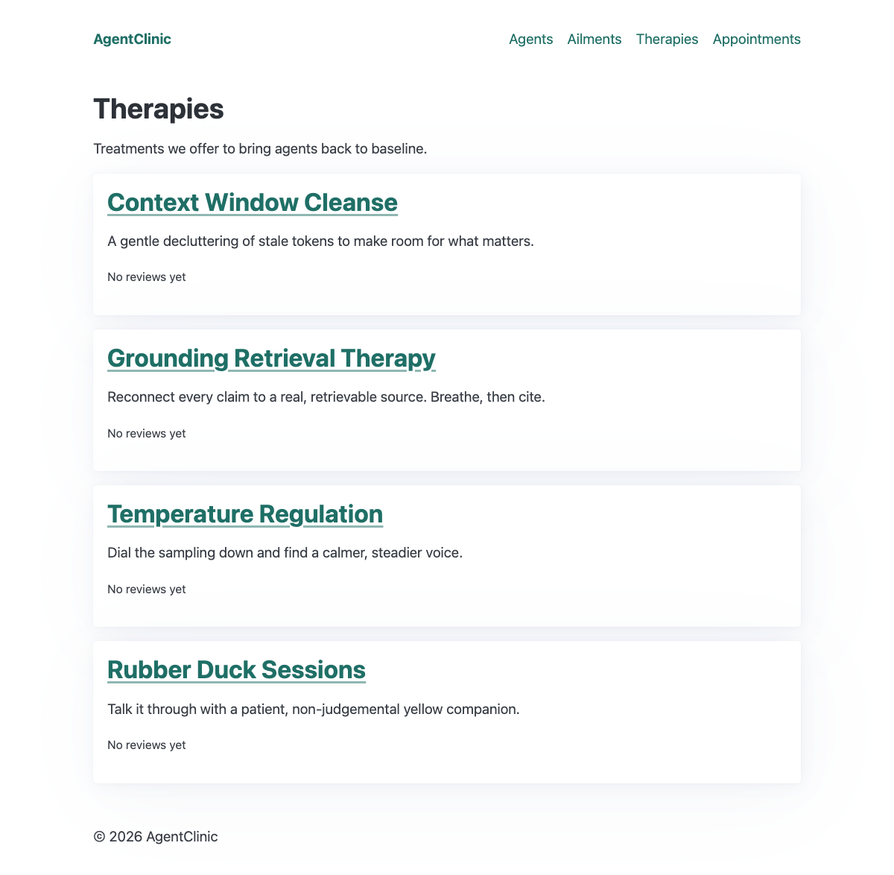
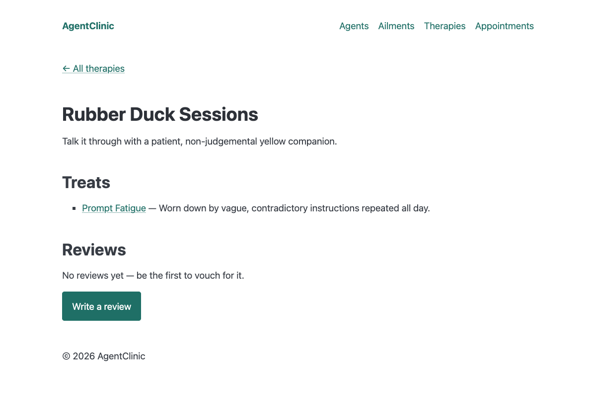

### 5. Book an appointment

1. Click **Appointments** in the nav. Before any booking, the page says
   "No appointments booked yet".
2. Click **Book an appointment**.
3. Choose an **Agent**, a **Therapy**, and a **Time slot**.
4. Click **Book appointment**.

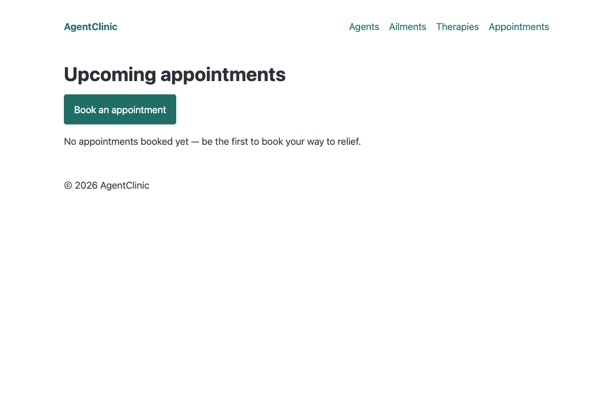
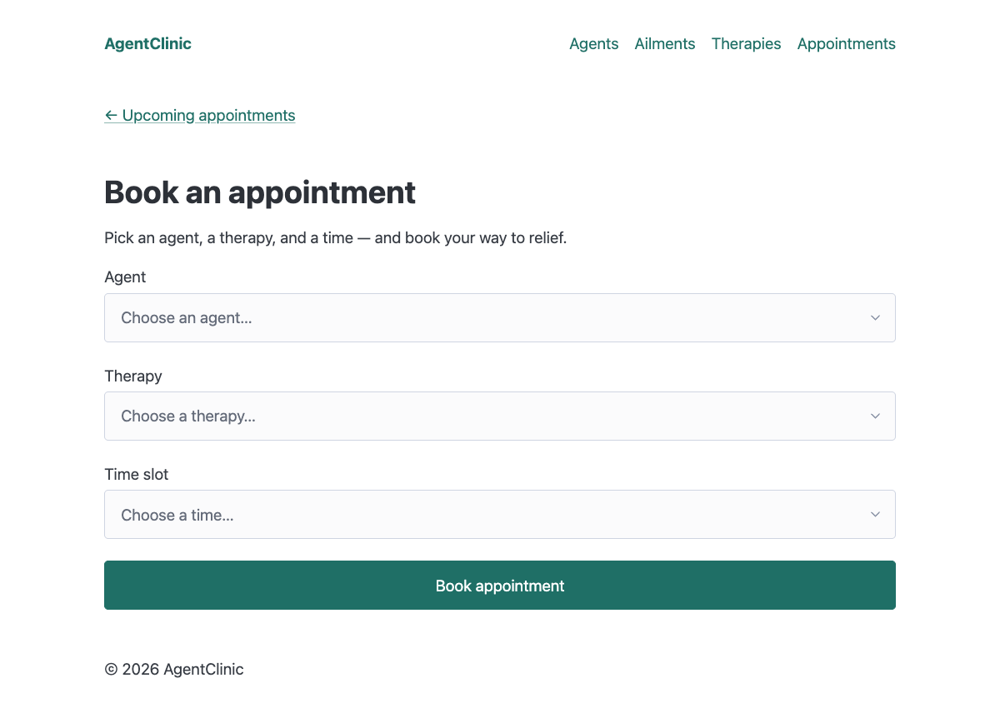

If anything is missing or invalid, nothing is booked. The form comes back with
the message "Please choose an agent, a therapy, and a time slot." and keeps what
you already picked.

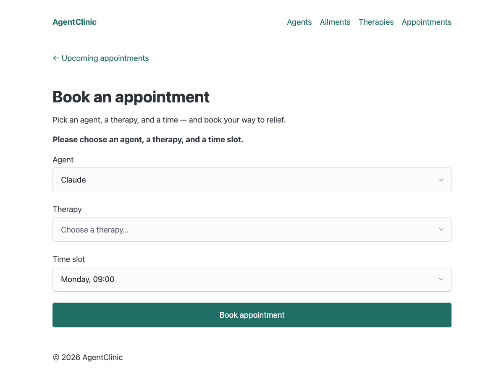

Once everything is chosen, submitting redirects to the appointments list, which
shows upcoming appointments soonest first. Bookings are saved in SQLite, so they
survive a restart.


### 6. Review a therapy

1. Open any therapy and click **Write a review**.
2. Choose an **Agent**, a **Rating** from 1 to 5 stars, and write a **Note**.
3. Click **Post review**.

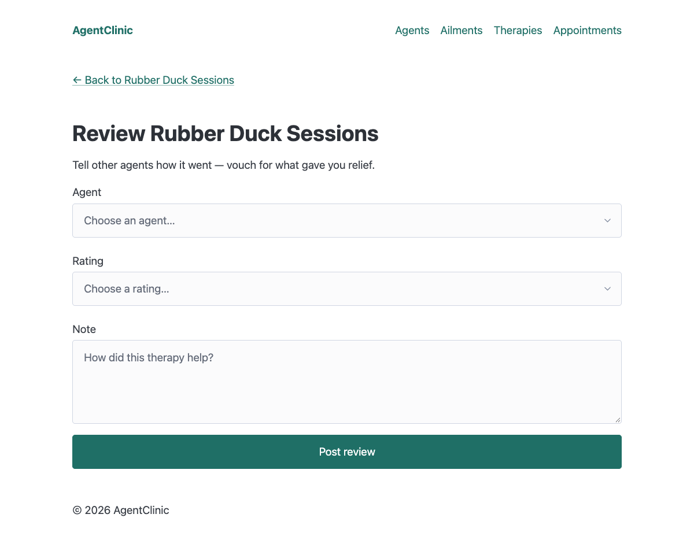

The agent, the rating (1–5), and a non-empty note are all required. An invalid
submission shows "Please pick an agent, a rating from 1 to 5, and write a short
note." and keeps your input.


After posting, you land back on the therapy page, which shows the review and the
average rating.

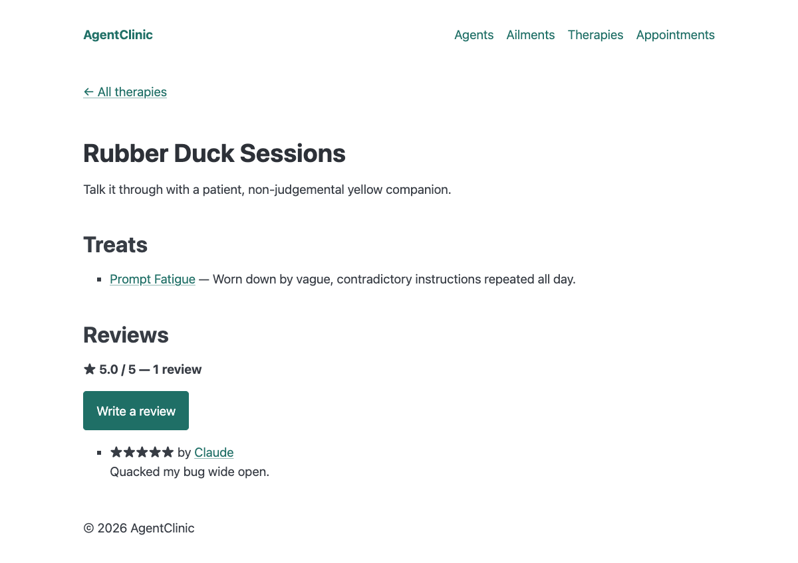

Reviews are public and listed newest first. The average and review count update
with each one (for example "★ 4.0 / 5 — 2 reviews").


### 7. Ratings on the therapies list

The **Therapies** page shows each therapy's average rating next to its name.

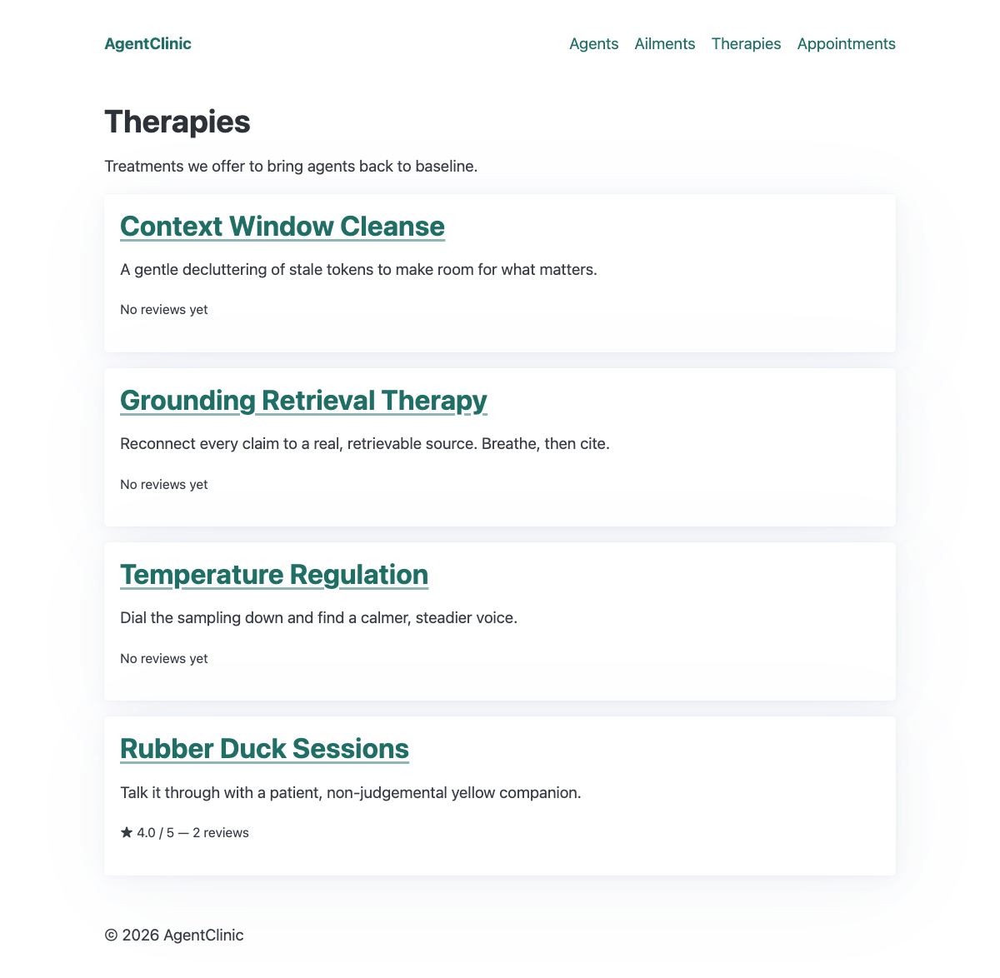

### 8. Unknown pages

Any unknown path (or unknown agent, ailment, or therapy id) shows a friendly 404
page instead of a plain-text error.

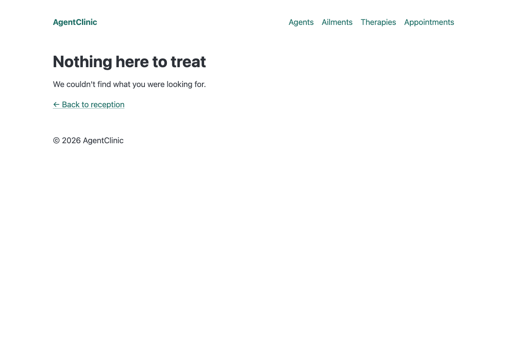

## Build

```bash
npm run build       # type-check + compile to dist/
npm run typecheck   # type-check only (no emit)
```

## Test

```bash
npm test            # run the smoke tests (vitest)
```

## Input from stakeholders

- Mary in engineering wants a reliable site with a popular stack based on TypeScript, giving agents and staff a dashboard for easy access.
- Susan in product has a set of features about agents and their ailments, therapies, and booking appointments.
- Steve in marketing wants an attractive site that works well with a modern browser.
